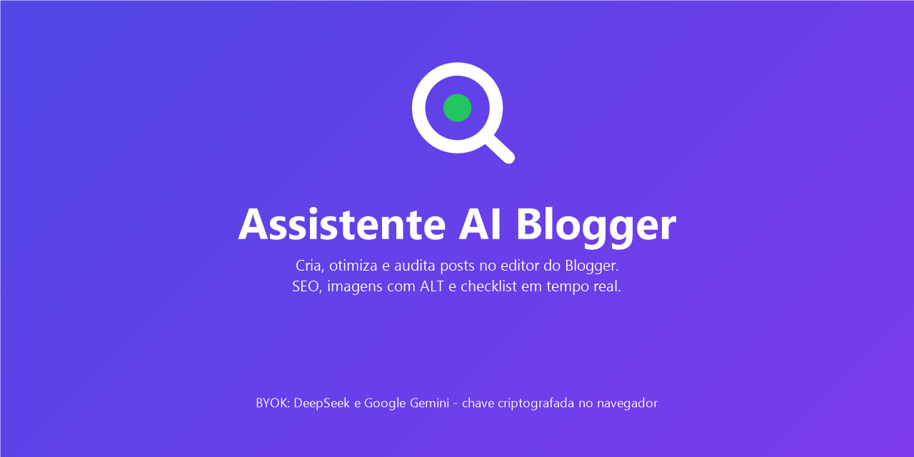
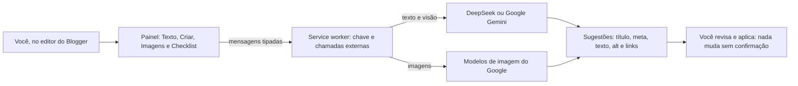

# Assistente AI Blogger


Extensão do Chrome (Manifest V3) que leva inteligência artificial para dentro do **editor do Blogger**: cria e otimiza textos com SEO, gera imagens e descrições ALT e audita o post em tempo real — sem sair da tela de edição e sem alterar nada sem a sua confirmação.

Funciona com a **sua própria chave** de IA (BYOK): **DeepSeek** ou **Google Gemini**, escolhidos no popup, com o outro podendo entrar como **reserva automática**. A chave fica guardada **criptografada** no seu navegador.

> Explicação em linguagem simples, para qualquer pessoa: [`docs/ENTENDA_O_PROJETO.md`](docs/ENTENDA_O_PROJETO.md).

## O que ele faz

| Recurso | Em poucas palavras |
|---|---|
| **Criar** | Escreve o rascunho completo do post a partir de um assunto e de uma personalidade (manual ou aprendida dos textos do blog), com links internos e fontes externas |
| **Texto** | Sugere título, meta-descrição e melhorias com base na palavra-chave; aplica com confirmação |
| **Imagens** | Cria imagens para o post e gera descrição (alt) e legenda para as imagens sem descrição |
| **Checklist** | Confere SEO e links em tempo real: título, meta, densidade da palavra-chave, subtítulos, imagens, alt e links |

## Como funciona



## Stack

| Camada | Tecnologia |
|---|---|
| Linguagem | TypeScript (compilado para JavaScript) |
| Build | Vite + `@crxjs/vite-plugin` |
| Extensão | Chrome Manifest V3 (Chrome 102 ou mais recente) |
| IA de texto | DeepSeek (`deepseek-flash`) e Google Gemini (`gemini-3.8-flash`), com principal + reserva |
| IA de imagem | Família de modelos de imagem do Google |
| Armazenamento | `chrome.storage.local` + criptografia AES-GCM (PBKDF2) |

## Instalação rápida (modo desenvolvedor)

```powershell
npm install
npm run build
```

1. Abra `chrome://extensions` e ative o **Modo do desenvolvedor**.
2. Clique em **Carregar sem compactação** e escolha a pasta `dist/`.
3. Configure a sua chave no popup da extensão (abaixo).

Passo a passo completo, incluindo como criar a chave: [`docs/INSTALACAO.md`](docs/INSTALACAO.md).

## Sua chave (BYOK)

1. Crie uma chave no [Google AI Studio](https://aistudio.google.com/app/apikey) ou na [DeepSeek](https://platform.deepseek.com/api_keys).
2. No popup da extensão, escolha o provedor principal, informe a chave e crie uma senha mestra.
3. Pronto: a chave fica criptografada e a extensão mostra no rodapé do painel qual serviço (e modelo) está ativo.

O uso da IA é cobrado pelo provedor escolhido (o Google tem camada sem custo para texto). Detalhes de segurança: [`docs/SEGURANCA.md`](docs/SEGURANCA.md).

## Documentação

| Documento | Para quê |
|---|---|
| [`docs/ENTENDA_O_PROJETO.md`](docs/ENTENDA_O_PROJETO.md) | Explicação em linguagem simples (para qualquer pessoa) |
| [`docs/INSTALACAO.md`](docs/INSTALACAO.md) | Compilar, instalar e configurar a chave |
| [`docs/COMO_USAR.md`](docs/COMO_USAR.md) | Guia de uso no editor do Blogger |
| [`docs/ARQUITETURA.md`](docs/ARQUITETURA.md) | Como o código é organizado e como as partes conversam |
| [`docs/SEGURANCA.md`](docs/SEGURANCA.md) | Criptografia, permissões e o que sai do navegador |
| [`docs/PRIVACIDADE.md`](docs/PRIVACIDADE.md) | Política de privacidade |
| [`docs/PUBLICACAO.md`](docs/PUBLICACAO.md) | Como publicar (GitHub e Chrome Web Store) |
| [`docs/DEVLOG.md`](docs/DEVLOG.md) | Histórico de decisões, problemas e pendências |

## Segurança e privacidade (resumo)

- A chave é cifrada com **AES-GCM 256 + PBKDF2** e usada somente no service worker — a página do Blogger nunca tem acesso a ela.
- **Sem telemetria, sem rastreamento, sem venda de dados**; o conteúdo só vai ao provedor de IA quando você aciona um recurso.

## Limitações conhecidas

- O painel aparece somente nas telas de edição de post do Blogger.
- A verificação de links externos depende de uma permissão opcional (autorizada no popup).
- Textos muito longos são analisados em partes de até 15 mil caracteres.
- **Inserção automática:** em alguns casos, o Blogger pode não salvar o corpo do post inserido pela extensão; o caminho garantido é **Copiar texto** e colar no editor com Ctrl+V antes de salvar (em investigação — veja o [`DEVLOG`](docs/DEVLOG.md)).
- Revise sempre o conteúdo sugerido pela IA antes de publicar.

## Contribuir e reportar problemas

Sugestões e problemas são bem-vindos: abra uma issue em <https://github.com/Georgebecker/blogger-ai-seo-assistant/issues> (ou use o contato do autor, abaixo).

## Licença

[MIT](LICENSE) — use, estude e adapte à vontade.

---

**Autor:** George Herman Becker — Gestor em TI

**Apoie o autor:**
- **PIX:** `a8b68e14-edfe-4450-88f2-c2af4aca2a6c`
- **Buy Me a Coffee:** <https://buymeacoffee.com/georgehbecker>
- **LinkedIn:** <https://www.linkedin.com/in/georgehbecker/>
