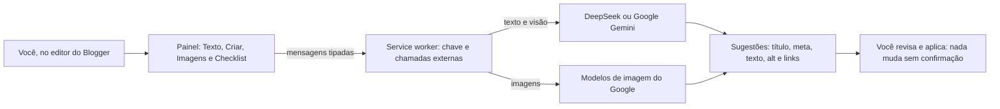

# Arquitetura e estrutura do código

## Visão geral



O painel (content script) nunca fala com a internet nem toca na chave: ele conversa, por mensagens tipadas, com o **service worker**, que é quem guarda a chave desbloqueada e faz todas as chamadas externas.

## Camadas e responsabilidades

| Parte | Arquivo | Papel |
|---|---|---|
| Interface na página | `src/content/content.ts` + `src/content/content.css` | Encontrar o editor (inclusive em iframes), ler e aplicar textos, desenhar o painel |
| Bastidores | `src/background/service-worker.ts` | Chaves, criptografia, prompts, chamadas às APIs, verificação de links |
| Popup | `src/popup/popup.html` + `src/popup/popup.ts` | Provedor principal, chave, senha mestra, reserva, permissão de links |
| Criptografia | `src/lib/crypto-utils.ts` | AES-GCM 256 + PBKDF2 (SHA-256, 210 mil iterações) |
| Contratos | `src/lib/messages.ts` | Tipos das mensagens trocadas entre painel, popup e service worker |

## Stack e decisões

| Decisão | Escolha | Motivo |
|---|---|---|
| Linguagem | TypeScript compilado para JavaScript | Tipagem estática evita APIs inexistentes e garante conformidade com o Manifest V3 |
| Build | Vite + `@crxjs/vite-plugin` | O plugin injeta os caminhos compilados no manifest do `dist/` |
| Manifest | V3 | Obrigatório para novas extensões |
| IA de texto | DeepSeek (`deepseek-flash`) e Google Gemini (`gemini-3.8-flash`), com principal + reserva | Texto e visão nos dois provedores |
| IA de imagem | Família de modelos de imagem do Google | Geração de imagens só no Google |
| Armazenamento | `chrome.storage.local` + AES-GCM (PBKDF2) | A chave nunca fica em texto puro; a cópia desbloqueada vive em `chrome.storage.session` |

## Fluxo de uma ação de IA

1. O painel monta o pedido (por exemplo, `AI_OPTIMIZE_TEXT` com texto, título e palavra-chave).
2. Envia por `chrome.runtime.sendMessage` seguindo o contrato de `src/lib/messages.ts`.
3. O service worker confere a chave desbloqueada na sessão e chama a API externa com `fetch` — somente aqui, porque o content script herda a origem da página e seria bloqueado por CORS.
4. A resposta é tratada (JSON robusto); em falha passageira há novas tentativas e, se a reserva estiver ligada, a chamada continua no outro provedor.
5. O painel mostra o resultado; nada é alterado no post sem confirmação do usuário.

## Contratos de mensagem

Fonte única: `src/lib/messages.ts`. Tipos disponíveis hoje:

| Mensagem | Para quê |
|---|---|
| `GET_STATUS` / `GET_USO` | Situação da chave e último uso registrado |
| `SAVE_KEY` / `UNLOCK` / `LOCK` / `TEST_KEY` | Salvar (cifrando), desbloquear, trancar e testar a chave |
| `SET_SETTINGS` | Provedor principal, modelo e reserva |
| `AI_OPTIMIZE_TEXT` | Otimizar texto (título, meta-descrição, melhorias) |
| `AI_IMAGE_ALT` | Gerar alt e legenda de uma imagem |
| `AI_APRENDER_ESTILO` | Ler posts do blog e capturar o estilo de escrita |
| `AI_GERAR_POST` | Criar o post completo com personalidade e SEO |
| `AI_PROMPT_IMAGEM` / `AI_GERAR_IMAGEM` | Montar o comando e gerar a imagem |
| `CHECK_LINKS` | Verificar se os links externos respondem |

## Decisões e problemas resolvidos (resumo)

- **Editor `contenteditable` (e iframes):** busca recursiva de janelas (`janelasAlcancaveis()`), escolha do editor por pontuação e escrita via Range + Selection + `execCommand`, sempre avisando o editor.
- **Service worker dorme:** estado crítico vai imediatamente para `chrome.storage.local`; o desbloqueio fica em `chrome.storage.session`; o listener de mensagens devolve `true` para manter o canal aberto.
- **CORS:** todo `fetch` externo acontece no service worker.
- **Dois provedores com reserva:** escolha no popup, chaves cifradas separadas e troca automática em falha, indisponibilidade ou falta de créditos.
- **Cota de imagem:** o nível gratuito do Google tem cota 0/dia — a extensão detecta, tenta os demais modelos e explica as alternativas em linguagem clara.

O histórico completo, com o porquê de cada decisão, está em [`DEVLOG.md`](DEVLOG.md).

## Estrutura de pastas

```
blogger-ai-seo-assistant/
├── manifest.json               # Manifest V3 (fonte; o build gera o do dist/)
├── package.json                # Scripts e dependências
├── tsconfig.json
├── vite.config.ts
├── docs/                       # Esta pasta (visão geral em ENTENDA_O_PROJETO.md)
├── public/
│   └── icons/                  # Ícones (gerados por tools/gerar_icones.py)
├── src/
│   ├── background/             # service-worker.ts — chaves, APIs, prompts
│   ├── content/                # content.ts + content.css — painel no editor
│   ├── popup/                  # popup.html + popup.ts — configuração
│   └── lib/                    # crypto-utils.ts + messages.ts
└── tools/
    ├── gerar_icones.py         # Gera os PNGs dos ícones (sem dependências)
    ├── teste_criptografia.ts   # Teste do cofre da chave
    └── empacotar_loja.ps1      # ZIP de publicação (pasta loja/)
```

## Como estender (para quem for mexer)

- Novo recurso: crie o contrato em `src/lib/messages.ts`, atenda em `tratarMensagem()` no service worker e chame pela interface (painel ou popup).
- Antes de considerar pronto: `npm run typecheck`, `npm run build` e, se tocar em criptografia, `npm run test:crypto`.
- As **regras invioláveis** (chave nunca no content script, `fetch` só no service worker, texto sempre escapado, sem classes voláteis do Blogger etc.) estão em [`DEVLOG.md`](DEVLOG.md), na seção "Para agentes de IA (leia antes de mexer)".
